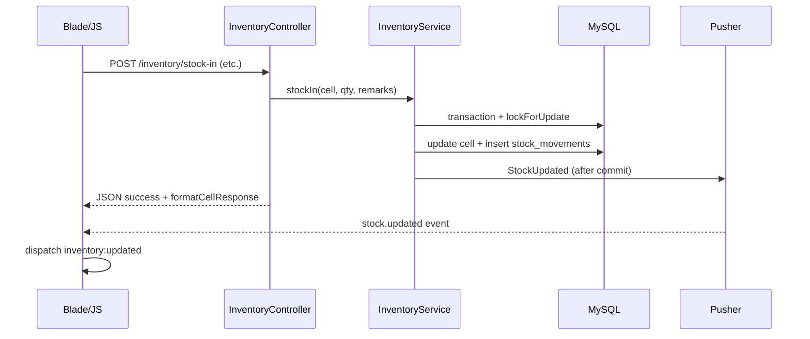

# J4G Inventory System — Complete System Overview

A current reference document for the J4G Printing Inventory System. Use this as context when working with the codebase (e.g. pasting into ChatGPT or another AI assistant).

**Last updated:** reflects dashboard analytics (ApexCharts), product inventory summary/history/sticky grid, and current route/test coverage.

---

## 1. Tech Stack

| Layer | Technology | Version / Notes |
|---|---|---|
| Language | PHP | 8.2+ |
| Framework | Laravel | 12.x (streamlined skeleton: middleware in `bootstrap/app.php`, no `app/Http/Kernel.php`) |
| Auth & Permissions | Spatie laravel-permission | latest |
| Realtime | Pusher + Laravel broadcasting | `StockUpdated` event on public channel `inventory` |
| Testing | Pest 3 + PHPUnit 11 | Feature tests in `tests/Feature/` |
| Code style | Laravel Pint 1.x | Run `vendor/bin/pint --dirty` |
| Frontend bundler | Vite 7 | Inputs: `app.css`, `app.js`, `dashboard.js` |
| CSS | Tailwind CSS v4 | Vite plugin; utility layer in `resources/css/app.css` |
| JS | Plain ES modules | No React, Vue, Livewire, or Inertia |
| HTTP client | Axios | Global via `resources/js/bootstrap.js` |
| Charts | ApexCharts | Used on dashboard via `resources/js/dashboard.js` |
| Local dev | Laravel Herd | `https://j4g-inventory-system.test` |
| DB (dev) | MySQL/MariaDB | Via Herd |

Server-rendered Blade pages + async JSON endpoints for tables, grids, and charts.

---

## 2. Domain Model and Database

### 2.1 Concept

A **Product** is something the print shop sells (e.g. T-Shirt, Reversible Adult). Each product has its own **sizes** and **colors**, drawn from global master tables. Inventory is tracked at the **cell** level: one row per `(product, color, size)` combination in `product_color_sizes`.

There is **no global inventory list page**. Inventory is managed per product at `/products/{product}/inventory`.

### 2.2 ER Diagram

```mermaid
erDiagram
    products ||--o{ product_size : has
    products ||--o{ product_color : has
    sizes ||--o{ product_size : referenced_by
    colors ||--o{ product_color : referenced_by
    product_color ||--o{ product_color_sizes : owns_cells
    product_size ||--o{ product_color_sizes : owns_cells
    product_color_sizes ||--o{ stock_movements : audited_in
    users ||--o{ stock_movements : created_by

    products {
      bigint id PK
      string name
      string code "unique, prefix for item_code"
      text description nullable
      string status "active|inactive"
    }
    sizes {
      bigint id PK
      string name "unique"
    }
    colors {
      bigint id PK
      string name "unique"
    }
    product_size {
      bigint id PK
      bigint product_id FK
      bigint size_id FK
      uint sort_order
    }
    product_color {
      bigint id PK
      bigint product_id FK
      bigint color_id FK
      string color_code "nullable, plain text per product"
      string item_code "unique, auto CODE-NNN"
      uint sort_order
    }
    product_color_sizes {
      bigint id PK
      bigint product_color_id FK
      bigint product_size_id FK
      uint current_stock
      uint reserved_quantity
      uint reorder_level
    }
    stock_movements {
      bigint id PK
      bigint product_color_size_id FK
      string type "IN|OUT|RESERVE|RELEASE|DAMAGED|ADJUSTMENT"
      int quantity
      int before_stock
      int after_stock
      int before_reserved
      int after_reserved
      string remarks nullable
      bigint created_by FK users
      timestamp created_at
    }
```

### 2.3 Key design decisions

- **Global masters, per-product pivots.** `sizes` and `colors` are shared lookup tables. Pivots `product_size` and `product_color` hold per-product attributes (`sort_order`, `color_code`, `item_code`).
- **`color_code` is plain text** (not hex). Per-product only. See `.cursor/rules/color-fields.mdc`.
- **`item_code`** auto-generated as `{PRODUCT_CODE}-{NNN}` by `ProductCodeService`. Product code renames cascade to all color item codes (model hook on `Product`).
- **Cells auto-created by model hooks.** Attaching a size creates a cell for every existing color (and vice versa) via `ProductSize::booted()` / `ProductColor::booted()`. Defaults: `current_stock = 0`, `reserved_quantity = 0`, `reorder_level = 0`.
- **All stock mutations go through `InventoryService`** inside `DB::transaction()` + `lockForUpdate()`.
- **Every mutation writes a `stock_movements` row** (append-only audit; no `updated_at`) and broadcasts `StockUpdated` after commit.
- **Inactive products** cannot receive inventory mutations (422 from controllers).

### 2.4 Stock semantics

Computed by `InventoryService::getStockStatus()`:

- `available_stock = current_stock - reserved_quantity`
- **`OUT_OF_STOCK`** if `available_stock <= 0`
- **`LOW_STOCK`** if `reorder_level > 0` AND `available_stock <= reorder_level` AND `available_stock > 0`
- **`OK`** otherwise

---

## 3. Models, Enums, Services

### 3.1 Models (`app/Models/`)

| Model | Table | Notable relations / hooks |
|---|---|---|
| `Product` | `products` | `sizes()`, `colors()`, `cells()` HasManyThrough. Rewrites item codes when `code` changes. |
| `Size` | `sizes` | Master size names. |
| `Color` | `colors` | Master color names. |
| `ProductSize` | `product_size` | Pivot; `booted()::created` seeds cells for all colors. |
| `ProductColor` | `product_color` | Pivot; assigns `item_code` on create; seeds cells for all sizes. |
| `ProductColorSize` | `product_color_sizes` | Cell; `movements()`, `available_stock` accessor. |
| `StockMovement` | `stock_movements` | `cell()`, `user()`; `type` → `MovementType` enum; append-only. |
| `User` | `users` | Spatie `HasRoles`; `status` gates login. |

### 3.2 Enums (`app/Enums/`)

- **`MovementType`:** `IN`, `OUT`, `RESERVE`, `RELEASE`, `DAMAGED`, `ADJUSTMENT`
- **`StockStatus`:** `OK`, `LOW_STOCK`, `OUT_OF_STOCK` (+ `label()`)
- **`RecordStatus`:** `active` / `inactive` (products, users)

### 3.3 Services (`app/Services/`)

**`InventoryService`** — single entry point for stock mutations:

| Method | Effect |
|---|---|
| `stockIn` | Adds to `current_stock` |
| `stockOut` | Subtracts from `current_stock` (checks available) |
| `reserve` | Adds to `reserved_quantity` |
| `release` | Subtracts from `reserved_quantity` |
| `damage` | Subtracts from `current_stock` |
| `adjust` | Sets `current_stock`; remarks required; optional `reorder_level` |
| `getAvailableStock` | `current - reserved` |
| `getStockStatus` | OK / LOW / OUT |
| `formatCellForDisplay` | Full DTO for inventory grid |
| `formatCellResponse` | Compact DTO for mutation API responses |

**`ProductCodeService`** — item code generation, prefix rebuild, name-to-prefix suggestion.

---

## 4. Authentication and Permissions

### 4.1 Auth flow

- Login at `GET/POST /login` (no self-registration).
- Logout via `POST /logout`.
- `EnsureUserIsActive` middleware logs out users with `status = inactive`.

### 4.2 Permissions (seeded)

```
view dashboard, view products, create products, edit products, delete products,
view inventory, stock in, stock out, reserve stock, release stock, damage stock, adjust stock,
view stock history, view low stock report, view out of stock report,
manage users, manage roles, manage permissions, manage sizes, manage colors
```

### 4.3 Roles

| Role | Access summary |
|---|---|
| **Admin** | All permissions |
| **Manager** | All except `manage roles`, `manage permissions` |
| **Staff** | Dashboard, full product CRUD, inventory + all stock actions, all reports |
| **Viewer** | Dashboard, view products/inventory, all reports (read-only) |

### 4.4 Seeded users (password: `password`)

- `admin@j4g.test`, `manager@j4g.test`, `staff@j4g.test`, `viewer@j4g.test`

### 4.5 Policies

- `ProductPolicy` → product CRUD permissions
- `SizePolicy` / `ColorPolicy` → `manage sizes` / `manage colors`

---

## 5. Main User Flows

### 5.1 Product setup

1. Create product (`POST /products`) with name, code, status.
2. On edit page, attach **sizes** and **colors** via async tables + modals.
3. Model hooks auto-create the color × size matrix (`product_color_sizes` cells).
4. Open **Manage Inventory** from products list (requires `view inventory`).

### 5.2 Stock mutation flow



All mutations: single cell modal, or bulk modal (`POST /inventory/bulk`). Bulk returns per-cell success/failure without rolling back successful rows.

### 5.3 Reports flow

- **Stock History** — filterable paginated movements (`view stock history`).
- **Low Stock** / **Out of Stock** — paginated cell reports with search.

Stock history supports `?product_id=` query param (pre-selects product filter when linked from inventory).

---

## 6. Dashboard and Analytics

**Page:** `GET /dashboard` (`view dashboard`)

**View:** `resources/views/dashboard/index.blade.php`  
**JS:** `resources/js/dashboard.js` (loaded via `@vite`; imports ApexCharts)

### 6.1 Summary cards (6)

Rendered server-side with icons; refreshed via `GET /dashboard/stats` on `inventory:updated`:

| Card | Metric |
|---|---|
| Total Products | Active product count |
| Total Stock | Sum of `current_stock` across active product cells |
| Total Reserved | Sum of `reserved_quantity` |
| Total Available | Total stock − reserved |
| Low Stock Cells | Cells with `LOW_STOCK` status |
| Out of Stock Cells | Cells with `OUT_OF_STOCK` status |

Cards link to products, reports, or low/out-of-stock pages when the user has permission.

### 6.2 Chart endpoints

All require `view dashboard`:

| Route | Purpose | Default params |
|---|---|---|
| `GET /dashboard/stock-health` | Donut: OK / Low / Out cell counts | — |
| `GET /dashboard/stock-movement-trend` | Line/area: Stock In, Out, Damaged by day | `days=14` (1–90) |
| `GET /dashboard/low-stock-by-product` | Stacked bar: top 10 products by issue count | — |
| `GET /dashboard/active-products` | Horizontal bar: top 10 products by movement count | `days=30` (1–90) |
| `GET /dashboard/recent-movements/data` | Paginated recent movements table | `per_page` 20/50/100 |

Stock health and low-stock charts use the same SQL status rules as `InventoryService`.

### 6.3 Recent movements table

- Async table via `initAsyncTable` in `dashboard.js`.
- Movement type column uses colored badges (IN green, OUT red, RESERVE/RELEASE blue, DAMAGED/ADJUSTMENT gray).
- **View All Stock History** button when user has `view stock history`.
- Refreshes on `inventory:updated` along with stats and charts.

---

## 7. Product Inventory Page

**Page:** `GET /products/{product}/inventory` (`view inventory` + product policy)  
**View:** `resources/views/products/inventory.blade.php`

### 7.1 Layout

1. **Summary cards (7)** — loaded from `GET /products/{product}/inventory/data` → `summary` key (totals across all cells, not just current page).
2. **Color × size grid** — async; colors paginated, sizes loaded in full.
3. **Search** — debounced filter on color name / item code.
4. **Per-page** — 20 / 50 / 100 colors per page.
5. **Sticky header + sticky first column** — CSS in `app.css` (`.inventory-grid-scroll`, `.inventory-grid-table`); see `.cursor/rules/sticky-table.mdc`.

### 7.2 Cell interactions

- Click cell → **Update Stock** modal (permission-gated actions: stock in/out, reserve, release, damage, adjust).
- Modal shows **Recent Stock History** (last 5 movements) via `GET /inventory/cell/{cell}/history`.
- **View Full History** links to stock history report filtered by product (`?product_id=`).
- **Bulk Update** modal for multi-cell operations on current grid page.
- Inactive products: read-only grid + warning banner.

### 7.3 Inventory data shape

`GET /products/{product}/inventory/data` returns:

```json
{
  "success": true,
  "product": { "id": 1, "name": "T-Shirt", "code": "TSC", "status": "active" },
  "sizes": [{ "id": 12, "size_name": "S", "sort_order": 1 }],
  "colors": [{
    "id": 7, "color_name": "BLACK", "item_code": "TSC-001",
    "cells": { "12": { "id": 101, "current_stock": 10, "status": "OK", ... } }
  }],
  "summary": {
    "total_colors": 32, "total_skus": 288, "total_stock": 5000,
    "total_reserved": 120, "total_available": 4880,
    "low_stock_count": 15, "out_of_stock_count": 8
  },
  "pagination": { "current_page": 1, "last_page": 2, "per_page": 20, "total": 32 }
}
```

Cells keyed by `product_size_id` in the `cells` object.

---

## 8. Reports

| Report | Page route | Data route | Permission |
|---|---|---|---|
| Stock History | `/reports/stock-history` | `/reports/stock-history/data` | `view stock history` |
| Low Stock | `/reports/low-stock` | `/reports/low-stock/data` | `view low stock report` |
| Out of Stock | `/reports/out-of-stock` | `/reports/out-of-stock/data` | `view out of stock report` |

Stock history filters: movement type, product, user, date range. Filter options via `/reports/stock-history/filter-options`.

All report tables use async pagination (20/50/100) via `TableDataRequest`.

---

## 9. Admin Modules

Prefix `/admin`, name `admin.*`:

| Module | Permission | Features |
|---|---|---|
| Users | `manage users` | List, create, edit (async table) |
| Roles | `manage roles` | List, edit permissions |
| Sizes | `manage sizes` | Master size CRUD (delete blocked if attached) |
| Colors | `manage colors` | Master color CRUD (delete blocked if attached) |

---

## 10. Frontend Architecture

### 10.1 Vite entries

```js
// vite.config.js
input: ['resources/css/app.css', 'resources/js/app.js', 'resources/js/dashboard.js']
```

Restart `npm run dev` after adding new Vite inputs.

### 10.2 JS modules

| File | Role |
|---|---|
| `bootstrap.js` | Axios global + CSRF defaults |
| `app.js` | Global helpers: `postData`, `showToast`, sidebar, user menu, notifications, Pusher `initPusher`, `inventory:updated` dispatch |
| `data-table.js` | `initAsyncTable`, `fetchTableData`, loading/empty/error/pagination, `renderStockBadge`, `debounce`, `escapeHtml` |
| `dashboard.js` | ApexCharts rendering, movement badges, dashboard config, recent movements table, chart refresh on `inventory:updated` |

### 10.3 CSS (`resources/css/app.css`)

- `.ui-table`, `.ui-modal-*`, toolbar utilities
- `.inventory-grid-scroll`, `.inventory-grid-table` sticky header/column styles

### 10.4 UI components (`resources/views/components/ui/`)

`button`, `input`, `select`, `textarea`, `label`, `badge`, `status-pill`, `page-header`, `page-card`, `async-table`, `stat-card` (optional `icon` prop), `empty-state`

### 10.5 Async table convention

```js
initAsyncTable({
  tbodyId, paginationId, dataUrl, columnCount, emptyMessage,
  getParams: () => ({ search: '...' }),
  getPerPage: () => 20,
  renderRows: (rows) => '...',
});
```

**Important:** `TableDataRequest` only allows `per_page` values **20, 50, 100**. Other values (e.g. 10 or 15) return **422 validation errors** and the table shows an error state.

---

## 11. Realtime Flow

- **Event:** `App\Events\StockUpdated` (`ShouldBroadcastNow`)
- **Channel:** public `inventory` (not per-product)
- **Event name:** `stock.updated`
- **Triggered by:** `InventoryService::applyMovement` via `DB::afterCommit`
- **Frontend:** `app.js` `initPusher()` subscribes to `inventory`, calls `updateVariantRow`, shows toast/notification, dispatches `inventory:updated`
- **Dashboard/inventory listeners:** refresh stats, charts, tables on `inventory:updated`

Requires Pusher env vars and `broadcasting.default=pusher` for live updates.

---

## 12. Routes Summary

### Removed routes

- Global `inventory.index` / `inventory.data` — inventory is per-product only.

### Current route groups

**Auth:** `/login`, `/logout`

**Dashboard** (`view dashboard`):
- `/dashboard`, `/dashboard/stats`
- `/dashboard/stock-health`, `/dashboard/stock-movement-trend`
- `/dashboard/low-stock-by-product`, `/dashboard/active-products`
- `/dashboard/recent-movements/data`

**Products** (`view products` read; `create|edit|delete products` write):
- `/products`, `/products/data`, CRUD routes, `/products/preview-code`

**Product sizes/colors** (`edit products`):
- Suggestions, data, store, bulk, update, destroy per product

**Inventory** (`view inventory` + action permissions):
- `/products/{product}/inventory`, `/products/{product}/inventory/data`
- `GET /inventory/cell/{cell}/history`
- `POST /inventory/{stock-in|stock-out|reserve|release|damage|adjust|bulk}`

**Reports:** stock-history, low-stock, out-of-stock (+ `/data`, filter-options)

**Admin:** `/admin/users|roles|sizes|colors` (+ data/CRUD)

Full list: `php artisan route:list`

---

## 13. Testing and Verification

### 13.1 Run tests

```bash
php artisan test --compact
php artisan test --compact --filter=DashboardChartsTest
vendor/bin/pint --dirty
npm run build
```

Current suite: **64 tests** (includes dashboard stats + charts, product inventory, bulk, concurrency, admin, auth, permissions).

### 13.2 Feature test files

| File | Coverage |
|---|---|
| `AuthTest` | Login/logout, inactive user |
| `PermissionAccessTest` | Role-based route access |
| `DashboardStatsTest` | Stats payload + auth |
| `DashboardChartsTest` | Dashboard page, chart endpoints, 403 for unauthorized |
| `ProductInventoryTest` | Inventory page/data, summary, cell history, stock actions |
| `InventoryServiceTest` | All mutation methods + audit + broadcast |
| `InventoryBulkTest` | Bulk endpoint scenarios |
| `InventoryConcurrencyTest` | `lockForUpdate` oversell prevention |
| `ProductRefactorTest` | Seeder, item codes, suggestions, backup |
| `AsyncTableDataTest` | Pagination envelope |
| `SizeAdminTest` | Admin size/color CRUD |
| `PermissionAccessTest` | Route guards |

Helpers in `tests/Helpers.php`: `seedBaseData()`, `userWithRole()`, `createTestProduct()`, `attachTestSize()`, `attachTestColor()`, `createTestCell()`.

### 13.3 Common commands

```bash
php artisan migrate:fresh --seed --no-interaction
php artisan inventory:backup
php artisan route:clear
npm run dev
```

---

## 14. Current Conventions and Gotchas

### Pagination

- Default `per_page` = **20**; allowed: **20, 50, 100** only (`TableDataRequest`).
- Inventory grid paginates **colors** (rows); **sizes** (columns) load in full.
- Do not use 25 or arbitrary values like 10 or 15 without updating `TableDataRequest` — the API returns **422** and async tables show an error state.
- `dashboard.js` recent-movements table currently passes `getPerPage: () => 10`; change to **20** (or extend `TableDataRequest`) for that table to load.

### Data loading

- List pages use async `/data` JSON endpoints — no server-rendered `@foreach` tables.
- Register `/data` routes **before** parameterized `{model}` routes.
- After mutations, reload current page via JS — avoid full page reload.

### Inventory rules

- Mutations only through `InventoryService` — never direct cell updates in controllers.
- Inactive products reject inventory mutations (422).
- `adjust` requires non-empty remarks.
- Adjusted stock cannot be less than reserved quantity.

### UI rules

- Shopify-admin style: compact, table-first, neutral palette (see `.cursor/rules/shopify-admin-ui.mdc`).
- `color_code` is plain text, not hex (see `color-fields.mdc`).
- Sticky grid tables: no padding on scroll container (see `sticky-table.mdc`).

### Cursor / AI rules (`.cursor/rules/`)

- `laravel-boost.mdc` — Laravel conventions, MCP tools
- `data-loading.mdc`, `table-pagination.mdc` — async tables
- `shopify-admin-ui.mdc`, `ui-design.mdc` — visual style
- `color-fields.mdc`, `sticky-table.mdc` — domain-specific UI rules

### Backup

`php artisan inventory:backup` exports products, masters, pivots, cells, and movements to JSON under `storage/app/`.

---

## Quick Glossary

| Term | Meaning |
|---|---|
| **Cell** | One inventory SKU at `(product, color, size)` in `product_color_sizes` |
| **Item code** | Unique per product color: `{PRODUCT_CODE}-{NNN}` |
| **Color code** | Optional plain-text label per product color |
| **Pivot row** | Row in `product_size` or `product_color` |
| **Master** | Global `sizes` or `colors` table |
| **Available stock** | `current_stock - reserved_quantity` |
| **Reserve** | Locks stock for pending orders without removing from `current_stock` |
| **Bulk update** | One action applied to multiple cells of one product in a single POST |

---

## File Map (selected)

```
app/
  Http/Controllers/
    AuthController, DashboardController, ProductController,
    ProductSizeController, ProductColorController,
    InventoryController, ReportController
    Admin/{User,Role,Size,Color}Controller.php
  Services/{InventoryService, ProductCodeService}.php
  Events/StockUpdated.php
  Enums/{MovementType, StockStatus, RecordStatus}.php
  Models/{Product, Size, Color, ProductSize, ProductColor, ProductColorSize, StockMovement, User}.php

resources/
  css/app.css
  js/{app.js, data-table.js, dashboard.js}
  views/
    dashboard/index.blade.php
    products/{index, create, edit, inventory}.blade.php
    reports/{stock-history, low-stock, out-of-stock}.blade.php
    admin/{users, roles, sizes, colors}/...

routes/web.php
tests/Feature/{DashboardChartsTest, DashboardStatsTest, ProductInventoryTest, ...}.php
```
